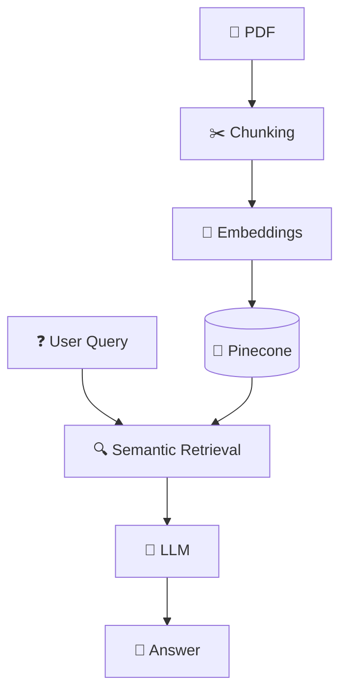
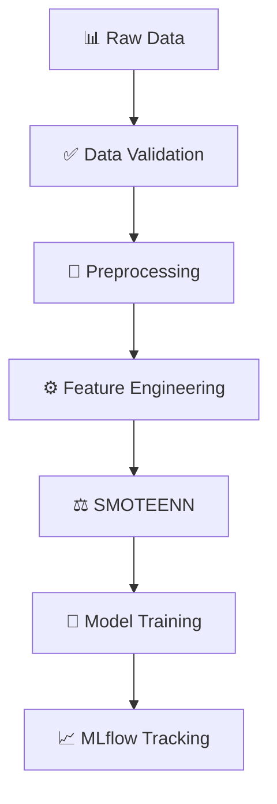
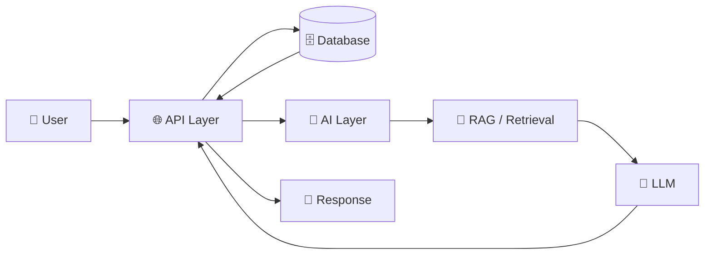
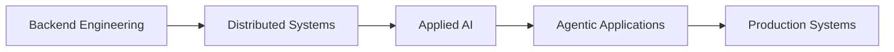

<div align="center">

# 👋 Hey, I'm Gaurav

### `Software Developer` · `Backend` · `Applied AI`

<br>


<br>

<a href="YOUR_LINKEDIN_URL">

</a>
&nbsp;
<a href="mailto:YOUR_EMAIL@gmail.com">

</a>

</div>

---

## `$ whoami`

```text
┌─────────────────────────────────────────────────────────────┐
│                                                             │
│  Software Developer                                         │
│                                                             │
│  I enjoy building backend systems and AI-powered            │
│  applications — from APIs and databases to RAG pipelines   │
│  and machine learning workflows.                            │
│                                                             │
│  I care about writing software that is simple, useful,       │
│  and actually works outside the notebook.                   │
│                                                             │
└─────────────────────────────────────────────────────────────┘
```

---

## 🧠 My Developer Stack

<div align="center">

### `01` — Languages


<br><br>

### `02` — Backend


<br><br>

### `03` — Data


<br><br>

### `04` — AI / ML


<br>

`LangChain` · `RAG` · `Embeddings` · `Vector Databases`

<br><br>

### `05` — Tools


</div>

---

## 🚀 Things I've Built

<table>
<tr>

<td width="50%" valign="top">

<h3>📄 DocuMate</h3>

<sub><b>AI × Documents × RAG</b></sub>

<br><br>

> Ask questions.
> Get answers.
> From your documents.

DocuMate is an AI-powered document assistant for interacting with lengthy PDF files.

### How it works



**Stack**

`FastAPI` · `LangChain` · `Pinecone` · `Embeddings` · `LLM`

</td>

<td width="50%" valign="top">

<h3>⚙️ MLOps Pipeline</h3>

<sub><b>ML × Automation × Reproducibility</b></sub>

<br><br>

> From raw data
> to a reproducible ML workflow.

An end-to-end machine learning pipeline focused on building a structured and reproducible training workflow.

### How it works



**Stack**

`Python` · `scikit-learn` · `SMOTEENN` · `MLflow`

</td>

</tr>
</table>

---

## 🔌 How I Think About Backend + AI



---

## 🛠️ What I Like Building

```yaml
backend:
  - REST APIs
  - backend services
  - database-driven applications
  - scalable application architecture

ai:
  - RAG systems
  - document intelligence
  - AI-powered applications
  - ML pipelines

engineering:
  - clean APIs
  - data pipelines
  - system integration
  - production-oriented applications
```

---

## 📡 Currently Exploring



---

## 💭 A Small Principle I Like

<div align="center">

### **Don't just make the model work.**

### **Make the whole system work.**

<br>

`Model` + `API` + `Data` + `Infrastructure` = `Application`

</div>

---

## 📊 My Tech Radar

| Area          | Technologies                                |
| :------------ | :------------------------------------------ |
| **Languages** | C++ · Python · JavaScript                   |
| **Backend**   | Node.js · Express.js · FastAPI · REST       |
| **AI / ML**   | scikit-learn · LangChain · RAG · Embeddings |
| **Databases** | PostgreSQL · MongoDB · Vector Databases     |
| **Tools**     | Git · GitHub · Docker · Postman             |

---

<div align="center">

### `while(alive) { build(); learn(); repeat(); }`

<br>


</div>
